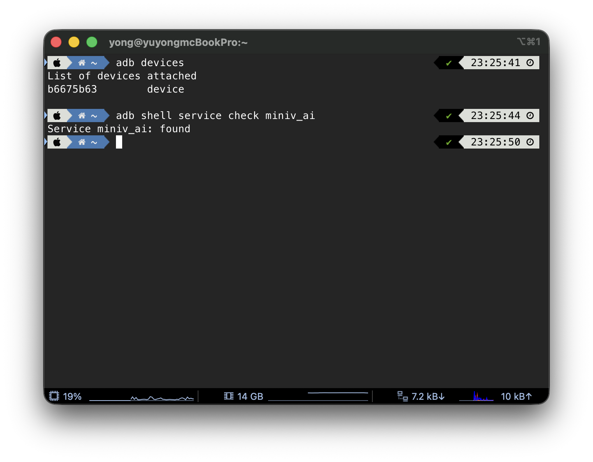
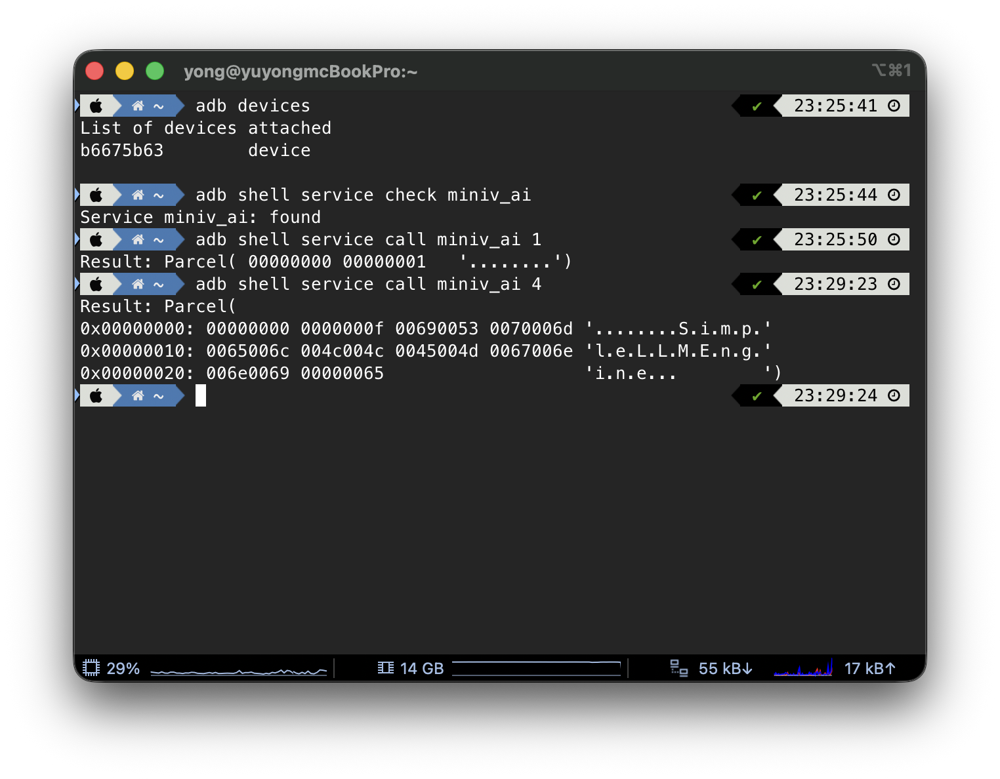

지난 포스팅에서 AIDL을 이용해 System Service를 구현하고 framework에 등록해보았습니다.<br/>
이번에는 간단하게 이 Service를 테스트해볼 수 있는 방법을 알아보겠습니다.

기본적으로 `adb shell`을 기반으로 호출 테스트를 해볼 수 있는데요,

먼저, Service가 잘 등록되어 있는지부터 확인해보겠습니다.
```bash
yong@ubuntu-desktop:~$ adb shell service check SERVICE_NAME
```
`servce check SERVICE_NAME` 명령어를 통해 특정한 이름의 Service가 등록되어 있는지 알 수 있습니다.<br/>
정상적으로 등록이 되었다면, 아래와 같이 found가 출력됩니다.



이번에는 Service의 메소드를 직접 호출하여, 그 출력 값을 확인해보겠습니다.
```bash
yong@ubuntu-desktop:~$ adb shell service call miniv_ai 1
yong@ubuntu-desktop:~$ adb shell service call miniv_ai 4
```
`service call SERVICE_NAME METHOD_INDEX` 명령어로 특정 Service의 특정 메소드를 호출해볼 수 있는데요,<br/>
다만 이 방법은 메모리 덤프를 통해 반환값을 확인하는 방법이기 때문에 복잡한 로직은 호출해볼 수 없다는 단점이 있습니다.

지난 포스팅에서 제가 정의한 `miniv_ai` Service의 1번 메소드는 `isReady()`이고,<br/>
4번 메소드는 `getModelInfo()` 메소드 입니다.



결과를 확인해보면, `isReady()`에서는 `true`를 의미하는 1이 반환되었고,<br/>
`getModelInfo()`에서는 제가 정의해둔 `SimpleLLMEngine`이 반환되어,<br/>
현재까지 구현한 내용이 정상적으로 동작하고 있음을 확인해볼 수 있었습니다.

다음 단계에서는 이 `miniv_ai` Service를 직접 호출해 통신하는 클라이언트 애플리케이션을 개발해보도록 하겠습니다.